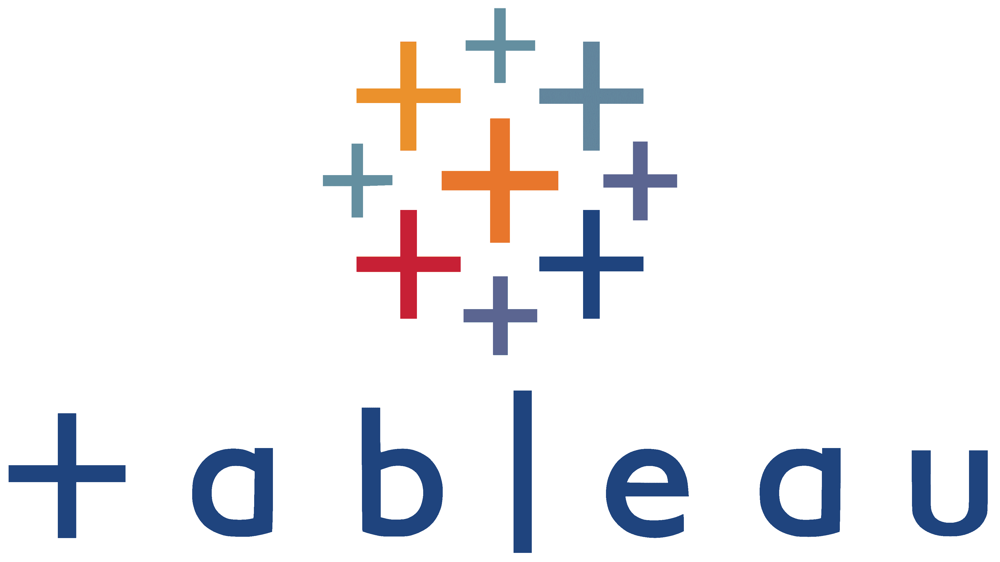
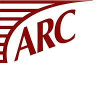
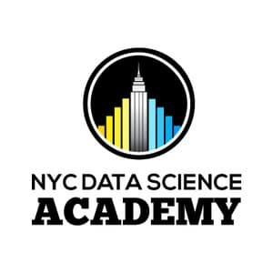

```{=html}
<style>
:root {
  --primary: #1a202c;
  --secondary: #2d3748;
  --accent: #667eea;
  --background: #f8fafc;
  --light-bg: #e2e8f0;
  --card-bg: #ffffff;
  --text: #2d3748;
  --text-light: #718096;
  --border: #cbd5e0;
  --shadow: rgba(0, 0, 0, 0.12);
}

* {
  margin: 0;
  padding: 0;
  box-sizing: border-box;
}

body {
  font-family: 'Inter', sans-serif;
  background: var(--background);
  color: var(--text);
  line-height: 1.6;
}

/* Navigation */
.navbar {
  position: fixed;
  top: 0;
  width: 100%;
  background: rgba(248, 250, 252, 0.95);
  backdrop-filter: blur(10px);
  border-bottom: 1px solid var(--border);
  z-index: 1000;
  padding: 1rem 0;
}

.nav-container {
  max-width: 1200px;
  margin: 0 auto;
  padding: 0 2rem;
  display: flex;
  justify-content: space-between;
  align-items: center;
}

.logo {
  font-weight: 700;
  font-size: 1.5rem;
  color: var(--primary);
}

.nav-links {
  display: flex;
  gap: 2rem;
  list-style: none;
}

.nav-links a {
  color: var(--text);
  text-decoration: none;
  font-weight: 500;
  transition: color 0.3s ease;
}

.nav-links a:hover {
  color: var(--accent);
}

/* Hero Section */
.hero {
  padding: 6rem 0 3rem;
  background: var(--background);
}

.hero-container {
  max-width: 1200px;
  margin: 0 auto;
  padding: 0 2rem;
  display: grid;
  grid-template-columns: 2fr 1fr;
  gap: 3rem;
  align-items: center;
}

.hero-content h1 {
  font-size: 2.8rem;
  font-weight: 700;
  color: var(--primary);
  margin-bottom: 0.5rem;
  line-height: 1.2;
}

.hero-content .subtitle {
  font-size: 1.2rem;
  color: var(--accent);
  margin-bottom: 1.5rem;
  font-weight: 500;
}

.hero-content p {
  font-size: 1rem;
  color: var(--text-light);
  margin-bottom: 1.5rem;
  line-height: 1.6;
}

.hero-buttons {
  display: flex;
  gap: 1rem;
}

.btn {
  padding: 0.75rem 2rem;
  border: none;
  border-radius: 6px;
  font-weight: 600;
  text-decoration: none;
  transition: all 0.3s ease;
  display: inline-flex;
  align-items: center;
  gap: 0.5rem;
}

.btn-primary {
  background: var(--accent);
  color: white;
}

.btn-primary:hover {
  background: #5a67d8;
  transform: translateY(-1px);
}

.btn-secondary {
  background: transparent;
  color: var(--accent);
  border: 2px solid var(--accent);
}

.btn-secondary:hover {
  background: var(--accent);
  color: white;
}

.hero-image {
  text-align: center;
}

.profile-img {
  width: 250px;
  height: 320px;
  border-radius: 12px;
  object-fit: cover;
  box-shadow: 0 10px 30px var(--shadow);
}

/* Section Styles - Made more compact */
.section {
  padding: 2rem 0;
}

.section-alt {
  background: var(--light-bg);
}

.container {
  max-width: 1200px;
  margin: 0 auto;
  padding: 0 2rem;
}

.section-title {
  text-align: center;
  margin-bottom: 1.5rem;
  padding-top: 0.5rem;
}

.section-title h2 {
  font-size: 1.8rem;
  font-weight: 700;
  color: var(--primary);
  margin-bottom: 0.25rem;
}

.section-title p {
  font-size: 0.9rem;
  color: var(--text-light);
}

/* Skills Section - Reduced spacing */
#skills {
  padding: 1rem 0;
}

#skills .section-title {
  padding-top: 0.25rem;
  margin-bottom: 1rem;
}

/* Skills Grid - Fixed centering */
.skills-grid {
  display: grid;
  grid-template-columns: repeat(6, 1fr);
  gap: 1rem;
  max-width: 600px;
  margin: 0 auto;
}

.skill-item {
  background: var(--card-bg);
  padding: 0;
  border-radius: 8px;
  box-shadow: 0 2px 10px var(--shadow);
  transition: all 0.3s ease;
  border: 1px solid var(--border);
  display: flex;
  align-items: center;
  justify-content: center;
  height: 80px;
  width: 80px;
  position: relative;
}

.skill-item:hover {
  transform: translateY(-3px);
  box-shadow: 0 5px 20px var(--shadow);
  border-color: var(--accent);
}

.skill-item img {
  width: 45px;
  height: 45px;
  object-fit: contain;
  position: absolute;
  top: 50%;
  left: 50%;
  transform: translate(-50%, -50%);
}

/* Experience Cards - More compact */
.experience-grid {
  display: grid;
  gap: 1rem;
}

.experience-card {
  background: var(--card-bg);
  padding: 1rem;
  border-radius: 8px;
  box-shadow: 0 2px 10px var(--shadow);
  transition: all 0.3s ease;
  border: 1px solid var(--border);
}

.experience-card:hover {
  transform: translateY(-2px);
  box-shadow: 0 5px 20px var(--shadow);
  border-color: var(--accent);
}

.experience-header {
  display: flex;
  align-items: center;
  gap: 1rem;
  margin-bottom: 0.75rem;
}

.company-logo {
  width: 50px;
  height: 50px;
  border-radius: 6px;
  overflow: hidden;
  flex-shrink: 0;
}

.company-logo img {
  width: 100%;
  height: 100%;
  object-fit: contain;
}

.experience-info h3 {
  font-size: 1.1rem;
  font-weight: 600;
  color: var(--primary);
  margin-bottom: 0.125rem;
}

.experience-info .role {
  color: var(--accent);
  font-weight: 500;
  margin-bottom: 0.125rem;
  font-size: 0.95rem;
}

.experience-info .duration {
  color: var(--text-light);
  font-size: 0.85rem;
}

.experience-description ul {
  list-style: none;
  padding: 0;
}

.experience-description li {
  position: relative;
  padding-left: 1.25rem;
  margin-bottom: 0.5rem;
  color: var(--text);
  font-size: 0.95rem;
  line-height: 1.5;
}

.experience-description li::before {
  content: '•';
  position: absolute;
  left: 0;
  color: var(--accent);
  font-weight: bold;
}

/* Footer */
footer {
  background: var(--light-bg);
  color: var(--text);
  text-align: center;
  padding: 2rem;
  border-top: 1px solid var(--border);
}

/* Responsive */
@media (max-width: 768px) {
  .hero-container {
    grid-template-columns: 1fr;
    text-align: center;
    gap: 2rem;
  }

  .hero-content h1 {
    font-size: 2.2rem;
  }

  .hero-content .subtitle {
    font-size: 1rem;
  }

  .skills-grid {
    grid-template-columns: repeat(3, 1fr);
    gap: 1rem;
  }

  .skill-item img {
    width: 45px;
    height: 45px;
  }

  .experience-header {
    flex-direction: column;
    text-align: center;
  }

  .nav-links {
    display: none;
  }
}

@media (max-width: 480px) {
  .skills-grid {
    grid-template-columns: repeat(2, 1fr);
  }
}
</style>

<!-- Navigation -->
<nav class="navbar">
  <div class="nav-container">
    <div class="logo">JESSICA JOY</div>
    <ul class="nav-links">
      <li><a href="#home">Home</a></li>
      <li><a href="#skills">Skills</a></li>
      <li><a href="#experience">Experience</a></li>
      <li><a href="#education">Education</a></li>
    </ul>
  </div>
</nav>

<!-- Hero Section -->
<section id="home" class="hero">
  <div class="hero-container">
    <div class="hero-content">
      <h1>Jessica Joy</h1>
      <div class="subtitle">Data Scientist</div>
      <p>
        Passionate data scientist with 3+ years of experience at EssenceMediacom, 
        specializing in Marketing Mix Modeling and data-driven strategy. Currently 
        pursuing MS in Data Science at Georgetown University. I am eager to expand my expertise, applying my analytical skills to solve complex challenges across industries. Let's connect!
      </p>
      <div class="hero-buttons">
        <a href="https://github.com/joyjessica" class="btn btn-primary" target="_blank">
          <i class="fab fa-github"></i>
          GitHub
        </a>
        <a href="https://www.linkedin.com/in/jessicajoy1019" class="btn btn-secondary" target="_blank">
          <i class="fab fa-linkedin"></i>
          LinkedIn
        </a>
      </div>
    </div>
    <div class="hero-image">
      
    </div>
  </div>
</section>

<!-- Skills Section -->
<section id="skills" class="section section-alt">
  <div class="container">
    <div class="section-title">
      <h2>Technical Skills</h2>
    </div>
    <div class="skills-grid">
      <div class="skill-item">
        
      </div>
      <div class="skill-item">
        
      </div>
      <div class="skill-item">
        
      </div>
      <div class="skill-item">
        
      </div>
      <div class="skill-item">
        
      </div>
      <div class="skill-item">
        
      </div>
    </div>
  </div>
</section>
```

<!-- Experience Section -->
::: {.section #experience}
::: {.container}
::: {.section-title}
## Professional Experience
:::

::: {.experience-grid}
::: {.experience-card}
::: {.experience-header}
::: {.company-logo}

:::
::: {.experience-info}
### EssenceMediacom
::: {.role}
Senior Analyst, Data Science and Modeling
:::
::: {.duration}
June 2021 – August 2024
:::
:::
:::
::: {.experience-description}
- Developed end-to-end Marketing Mix Models (MMM) for major clients, improving data processing efficiency of 10M+ rows using Python, R, and SQL
- Constructed budget allocation tool using MMM outputs, optimizing media mix strategies and driving up to 30% increase in incremental revenue
- Provided strategic consultation to Dell using vision AI data and ML algorithms, analyzing 200+ variables to potentially increase KPIs by 130%
- Built database of 70+ marketing metrics for "Remarkability Index," strengthening new business pitches and securing clients
:::
:::

::: {.experience-card}
::: {.experience-header}
::: {.company-logo}

:::
::: {.experience-info}
### Binghamton University
::: {.role}
Economics Tutor
:::
::: {.duration}
August 2019 – December 2019
:::
:::
:::
::: {.experience-description}
- Provided one-on-one tutoring to Division 1 athletes in Microeconomic Theory and Macroeconomics
- Designed engaging activities to improve student comprehension and interest
- Collaborated with professors to prioritize key concepts and topics
:::
:::

::: {.experience-card}
::: {.experience-header}
::: {.company-logo}

:::
::: {.experience-info}
### CRC Group
::: {.role}
Broker Intern
:::
::: {.duration}
June 2019 – August 2019
:::
:::
:::
::: {.experience-description}
- Analyzed and audited policies and endorsement data to ensure accuracy
- Streamlined quoting and binding processes, reducing processing time
- Conducted visits to insurance carriers and retail brokers for business insights
:::
:::

::: {.experience-card}
::: {.experience-header}
::: {.company-logo}

:::
::: {.experience-info}
### ARC Excess & Surplus
::: {.role}
Insurance Underwriting Intern
:::
::: {.duration}
August 2018 – December 2018
:::
:::
:::
::: {.experience-description}
- Updated and managed underwriting data systems, ensuring timely analysis and decision-making for over 100 accounts
- Monitored and tracked policy transactions to ensure on-time issuance
- Facilitated communication between clients and underwriters for clear documentation
:::
:::
:::
:::
:::

<!-- Education Section -->
::: {.section .section-alt #education}
::: {.container}
::: {.section-title}
## Education & Certifications
:::

::: {.experience-grid}
::: {.experience-card}
::: {.experience-header}
::: {.company-logo}

:::
::: {.experience-info}
### Georgetown University
::: {.role}
MS Data Science and Analytics
:::
::: {.duration}
Expected December 2025 | GPA: 4.00/4.00
:::
:::
:::
::: {.experience-description}
- **Leadership:** Women in Data Science Leadership Committee
- **Coursework:** Probabilistic Modeling, Computational Linguistics, Advanced Data Visualization, Neural Networks
:::
:::

::: {.experience-card}
::: {.experience-header}
::: {.company-logo}

:::
::: {.experience-info}
### Binghamton University
::: {.role}
BS Financial Economics
:::
::: {.duration}
May 2020 | Major GPA: 3.78/4.00
:::
:::
:::
::: {.experience-description}
- **Study Abroad:** Universidad Pontificia Comillas, Madrid, Spain
- **Leadership:** Alpha Epsilon Phi Treasury Committee, Helping Hand Project Founding Member
- **Coursework:** Econometric Methods, Economic Forecasting
:::
:::

::: {.experience-card}
::: {.experience-header}
::: {.company-logo}

:::
::: {.experience-info}
### NYC Data Science Academy
::: {.role}
Data Science Fellow
:::
::: {.duration}
January 2021 – April 2021
:::
:::
:::
::: {.experience-description}
- Intensive data science bootcamp covering machine learning, statistical modeling, and data visualization
- [Check out my blog!](https://nycdatascience.com/blog/author/jessica-joy/){style="color: var(--accent); text-decoration: none; font-weight: 500;"}
:::
:::
:::
:::
:::

```{=html}
<footer>
  <p>&copy; 2025 Jessica Joy</p>
</footer>
```